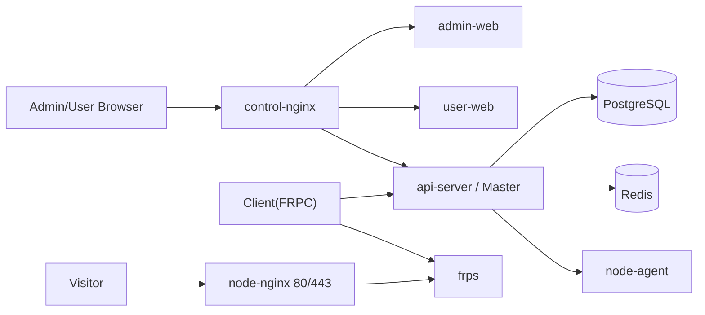

# 控制面与 Server(FRPS) 节点分离部署

本项目支持把后台控制面、用户控制台和 Server(FRPS) 节点拆开部署。

## 1. 角色

控制面服务器：

- `api-server`：Master Control Plane。
- `admin-web`：Admin Console。
- `user-web`：User Console。
- `postgres` / `redis` / `mail-server` / `control-nginx`。

节点服务器：

- `frps`：FRP 服务端。
- `nginx`：Server(FRPS) 节点 HTTP/HTTPS 入口。
- `node-agent`：节点运维代理。
- certbot runtime、日志、frps 配置目录。

用户本地：

- `frp-client`：Client(FRPC)。
- `client-webui`：本地 UI，默认 `http://127.0.0.1:18080`。

## 2. 通信关系



## 3. 部署控制面

```bash
cd deploy
cp .env.control.example .env.control
# 编辑 .env.control
# ADMIN_DOMAIN=admin.example.com
# USER_DOMAIN=panel.example.com
# API_DOMAIN=api.example.com
# NODE_AGENT_URL=http://NODE_SERVER_IP:8090
# NODE_AGENT_TOKEN=<same as node>

docker compose --env-file .env.control -f docker-compose.control.yml up -d --build
```

## 4. 部署节点面

```bash
cd deploy
cp .env.node.example .env.node
# 编辑 .env.node
# FRP_ENTRY_DOMAIN=frp.example.com
# SERVER_ADDR=frp.example.com
# NODE_AGENT_TOKEN=<same as control>
# CERTBOT_DRY_RUN=true

docker compose --env-file .env.node -f docker-compose.node.yml up -d --build
```

生产环境建议只允许控制面服务器访问节点服务器 `8090/tcp`。

## 5. 节点绑定

后台进入 `FRPS 节点`：

1. 新增节点，填写节点名、Agent URL、入口域名、frpc 连接地址、frps 端口、TCP/UDP 端口池。
2. 后台生成 `NODE_BIND_TOKEN`。
3. 节点 `.env.node` 填入 `CONTROL_PLANE_URL` 和 `NODE_BIND_TOKEN`。
4. 节点启动后调用 `POST /api/nodes/bind`，领取专属 agent token。
5. 后台节点状态变为 online。

## 6. 可用 API

节点管理：

```text
GET    /api/admin/nodes
POST   /api/admin/nodes
GET    /api/admin/nodes/{id}/status
GET    /api/admin/nodes/{id}/frps-config
GET    /api/admin/nodes/{id}/frps-logs
POST   /api/admin/nodes/{id}/frps-restart
POST   /api/admin/nodes/{id}/frps-reload
POST   /api/admin/nodes/{id}/nginx-test
POST   /api/admin/nodes/{id}/nginx-reload
DELETE /api/admin/nodes/{id}/delete
POST   /api/nodes/bind
```

拓扑摘要：

```text
GET /api/user/topology
GET /api/admin/topology
```

用户 topology 不返回节点密钥和支付密钥。

## 7. 端口建议

控制面服务器：

```text
80/tcp 或 443/tcp  control-nginx
25/587/993         邮件服务，按需开放
```

节点服务器：

```text
80/tcp             HTTP 隧道入口和 ACME challenge
443/tcp            HTTPS 隧道入口
7000/tcp           frpc 连接 frps
20000-29999/tcp    TCP 隧道端口池
30000-39999/udp    UDP 隧道端口池
8090/tcp           node-agent，仅允许控制面访问
```

用户本地：

```text
127.0.0.1:18080    Client(FRPC) WebUI
```


## 2026-07-09 ??????

- `.env.control` ? `.env.node` ??????????? `FRP_TOKEN`???????????
- `NODE_AGENT_TOKEN` ?????????????? `NODE_BIND_TOKEN` ?????node-agent ????????????? agent token????????
- node-agent ????? compose ???? `127.0.0.1:8090`??????????????????????? IP?
- node-agent ? restart/reload/test/config/certificate ???????? POST ??? `Authorization: Bearer <NODE_AGENT_TOKEN>`?
- ??? API ? `FRP_TOKEN` ???? frpc ????? frps ???? token ?????????? `docs/SECURITY.md`?
