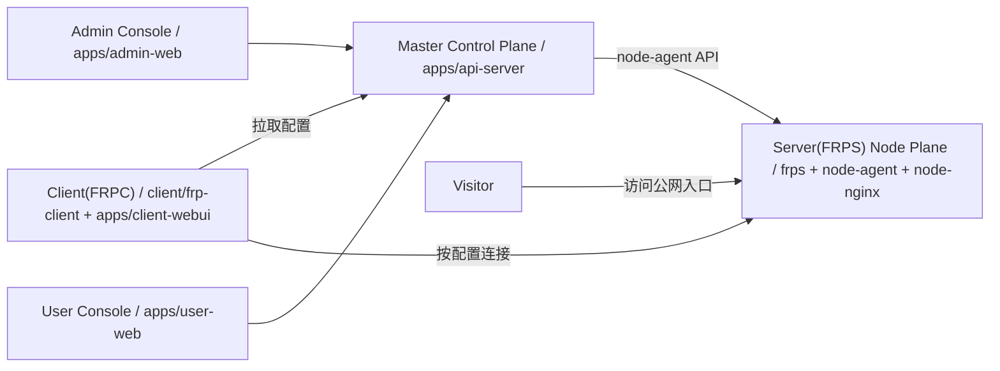

# frp-panel 角色映射

## 总览

## 角色职责

| 角色 | 本项目实现 | 职责 | 不应该负责 |
| --- | --- | --- | --- |
| Master Control Plane | `apps/api-server` | 用户、套餐、订单、支付、兑换码、隧道、节点、证书、流量、frpc 配置生成、API 托管测速 | 直接承载公网隧道流量 |
| Admin Console | `apps/admin-web` | 管理 Master 资源、节点运维、支付配置状态、操作日志 | 面向普通用户开放 |
| User Console | `apps/user-web` | 用户套餐、隧道、节点安全字段、客户端下载、域名证书、兑换码、测速 | 暴露节点密钥或后台字段 |
| Server(FRPS) Node Plane | `frps` + `apps/node-agent` + `node-nginx` | frpc 连接入口、公网端口池、HTTP/HTTPS vhost、节点日志/配置/重启/reload | 保存套餐、订单、支付状态 |
| Client(FRPC) | `client/frp-client` + `apps/client-webui` | 保存 API 地址和 token、同步配置、控制 frpc、提供本地日志和测速服务 | 管理其他用户或节点 |
| Visitor | 外部浏览器、App、网络客户端 | 访问用户公开入口 | 使用控制面 API |

## 关键流程

### 创建并访问隧道

1. 用户在 User Console 创建隧道。
2. Master 校验套餐、协议、端口、域名和限速，保存隧道。
3. Client(FRPC) 从 Master 拉取配置并启动 frpc。
4. Client(FRPC) 按配置连接 Server(FRPS)。
5. Visitor 访问 Server(FRPS) 暴露的公网入口。
6. Server(FRPS) 经 frpc 转发到用户本地服务。

### 节点运维

1. Admin 在 Admin Console 选择 FRPS 节点。
2. Master 通过 node-agent 调用节点状态、配置、日志、restart、reload、nginx test 或 nginx reload。
3. Admin Console 在 NodeOperationPanel 中展示操作结果。
4. 操作写入 Admin Operation Log。

### API 托管测速

1. User Console 请求本地 Client(FRPC) 准备 benchmark 服务。
2. Master 创建临时 Speed Test Tunnel。
3. Client(FRPC) 同步临时配置并重启 frpc。
4. API Server 发起测速请求穿过 Server(FRPS) 到本地 benchmark 服务。
5. Master 记录测速流量并清理临时隧道。
6. User Console 展示速度、延迟、限速占比和瓶颈判断。

## 安全边界

- User Console 只能读取安全节点字段：节点名、入口域名、连接地址、端口池、在线状态、最后在线时间。
- User Console 不返回 `agent_token`、`bind_token`、支付密钥、frps token、管理员操作日志详情。
- Admin Console 可查看节点运维结果，但支付密钥仅展示是否已配置，不直接返回明文。
- Client(FRPC) 只保存当前用户 token，只拉取当前用户隧道配置。
