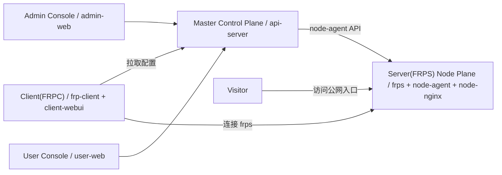

# FRP 平台架构设计

## 1. 架构目标

本项目采用 frp-panel 的角色模型描述系统边界：Master / Server(FRPS) / Client(FRPC) / Visitor。目标是让后台管理端、用户控制台、本地客户端和节点运行面职责清晰，便于后续多节点、套餐计费、支付、兑换码、测速和证书自动化扩展。

## 2. 角色映射



### Master Control Plane

`apps/api-server` 是唯一可信数据源，负责：

- 用户、管理员、登录会话。
- 套餐、订阅、流量额度、协议权限和隧道数量限制。
- 订单、易支付、支付回调、兑换码。
- 隧道创建、端口分配、域名唯一性、frpc 配置生成。
- 节点清单、node-agent 调用、FRPS 状态/配置/日志/重启/reload。
- 证书申请、续期、Nginx 测试/reload。
- API Server 托管测速。

### Server(FRPS) Node Plane

节点由 frps、node-agent、node-nginx 组成，负责：

- frpc 连接入口。
- TCP/UDP 端口池。
- HTTP/HTTPS vhost 入口。
- 节点本地 Nginx、frps、证书运行时操作。

节点不保存套餐、订单、支付密钥或用户业务状态。

### Client(FRPC)

用户本地 Windows/Linux 客户端负责：

- 保存 Master API 地址和用户 token。
- 拉取当前用户 frpc 配置。
- 写入本地 `frpc.toml`。
- 启动、停止、重启 frpc。
- 展示本地日志。
- 为测速打开临时 benchmark 服务。

### Visitor

Visitor 是访问公网入口的浏览器、App 或任意网络客户端。Visitor 不直接访问 Master API。

## 3. 前端架构

三端统一使用 React + Vite + Ant Design，并共享 `apps/shared/frontend`：

```text
apps/shared/frontend/
  api/client.js
  theme/antdTheme.js
  components/AppShell.jsx
  components/RoleTopology.jsx
  components/CollapsedMenuLabel.jsx
  components/MetricCard.jsx
  components/StatusBadge.jsx
  components/LogPanel.jsx
  components/NodeOperationPanel.jsx
  styles/global.css
```

统一布局：

- 左侧 232px 分组菜单，可折叠到 72px。
- 顶部 56px 工具栏，包含面包屑、刷新、用户信息、退出。
- 内容区使用 Alert、指标卡、Steps、Table、Drawer、LogPanel。
- 折叠菜单四字中文显示为上下各两个字。

## 4. 核心流程

### 4.1 创建隧道

1. 用户在 User Console 选择协议、节点、本地服务和公网入口。
2. Master 校验订阅、协议权限、流量、隧道数量、域名和限速。
3. Master 保存隧道并分配远程端口或域名入口。
4. Client(FRPC) 从 Master 拉取配置。
5. frpc 连接 Server(FRPS)。
6. Visitor 访问公网入口。

### 4.2 支付与套餐

1. 后台在套餐管理中新增或修改 Plan。
2. 用户在套餐支付页选择 Plan 和支付方式。
3. Master 根据 pay_type 生成易支付订单。
4. 支付回调验签通过后激活订阅。
5. 后台订单支付页展示订单和支付方式绑定状态。

### 4.3 兑换码

1. 后台生成兑换码时必须选择 Plan。
2. 用户兑换后 Master 激活对应 Plan。
3. 兑换日志写入管理员操作日志。

### 4.4 节点运维

1. Admin Console 选择 FRPS 节点。
2. Master 调用对应 node-agent。
3. NodeOperationPanel 展示状态、配置、日志、重启、reload 或 Nginx 操作结果。
4. 操作写入管理员操作日志。

### 4.5 API 托管测速

1. User Console 调用本地 Client(FRPC) 准备 benchmark。
2. Master 创建临时 Speed Test Tunnel。
3. Client(FRPC) 同步临时配置并重启 frpc。
4. API Server 通过公网入口发起测速。
5. Master 记录测速流量并清理临时隧道。
6. User Console 展示吞吐、延迟、限速占比和瓶颈判断。

## 5. 安全边界

- 普通用户只能管理自己的隧道、套餐、证书申请和测速。
- 用户端 topology 只返回 SafeNode：节点名、入口域名、连接地址、端口池、状态、最后在线时间。
- 用户端不返回 node-agent token、bind token、支付密钥、frps token、管理员日志详情。
- 支付密钥仅从环境变量读取；后台只显示是否配置。
- frps token 只返回给本地 Client(FRPC) 配置接口，不在 topology 中暴露。

## 6. 部署形态

- 飞牛一体化：api-server、user-portal、admin-portal、postgres、redis。
- 控制面/节点面分离：control compose 运行 Master/Admin/User，node compose 运行 Server(FRPS) 节点。
- 本地客户端：用户自行下载 Windows/Linux 包，在本机启动 Client(FRPC)。
