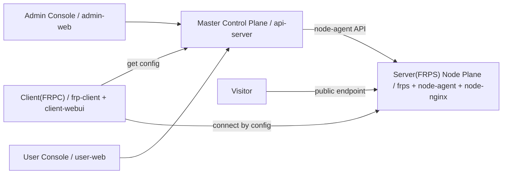

# FRP 商业平台总实施计划

> **For agentic workers:** REQUIRED SUB-SKILL: Use `implement` for execution, `frontend-design` for UI work, `diagnosing-bugs` for线上问题复现修复, `playwright` for browser验收。步骤使用 checkbox (`- [ ]`) 追踪。

**Goal:** 把当前 FRP 商业平台合并推进为“后台管理端 + 用户控制台 + 本地客户端”三端分离、排版接近 mefrp、架构表达对齐 frp-panel、支付/套餐/兑换码/节点运维/测速全流程可用的一体化商业系统。

**Architecture:** `api-server` 作为 Master Control Plane；`node-agent + frps + node-nginx` 作为 Server(FRPS) Node Plane；用户本地 Win/Linux 客户端作为 Client(FRPC)；外部访问者作为 Visitor。前端分成 `admin-web`、`user-web`、`client-webui` 三个独立应用，共享主题、布局组件、API client 和通用业务组件。

**Tech Stack:** Go API Server、PostgreSQL、Redis、frps/frpc、node-agent、React、Vite、Ant Design、Nginx、Docker Compose、Playwright。

## Global Constraints

- 默认中文界面和中文文档。
- mefrp 只参考信息架构、排版动线、组件组织方式，不复制品牌、Logo、图片素材和专有文案。
- frp-panel 只参考角色架构：Master / Server(FRPS) / Client(FRPC) / Visitor。
- 用户端不得暴露 `agent_token`、`bind_token`、支付密钥、frps 管理密钥、管理员日志详情等敏感字段。
- 后台和用户控制台必须是独立容器。
- 本地 Win/Linux 客户端必须是独立下载和独立运行形态。
- 支付通道需兼容当前易支付 V1：`https://pay.flwi.top`，通道别名 `wxpay_zg` 需要能正确映射到微信支付 `pay_type=wxpay`。
- 用户端入口保持 `http://192.168.110.56:18188`。
- 后台入口保持 `http://192.168.110.56:18189`。
- 后台管理员账号由部署环境维护，不能写入前端源码。
- 全部完成后必须做真实全流程测试。

---

## 1. 总体目标拆解

### 1.1 业务修复目标

- [ ] 后台节点列表中“状态 / 配置 / 日志 / 重启 / reload / nginx test / nginx reload”全部可点击、可反馈、可记录日志。
- [ ] 左侧栏收起时，四字中文菜单上下各两个字显示，例如“套餐管理”显示为“套餐 / 管理”。
- [ ] 后台套餐管理支持新增套餐和编辑套餐。
- [ ] 后台用户管理支持修改用户套餐、套餐到期时间、流量额度、隧道数、限速等信息。
- [ ] 后台兑换码生成必须选择套餐，兑换后绑定到对应套餐。
- [ ] 检查兑换码日志误报错原因：确认是否由页面初始化自动请求、空参数生成、轮询、测试脚本或后端默认查询造成。
- [ ] 后台支付方式绑定入口清晰展示，能看到微信/支付宝与具体通道的绑定关系。
- [ ] 修复支付失败“未配置该支付方式的通道”：`wxpay_zg`、`微信支付`、`wechatpay` 等别名统一映射为易支付 V1 的 `wxpay`。
- [ ] API Server 发起测速，避免纯客户端测速受用户端宽带/浏览器限制导致结果不可信。
- [ ] 自动注册一个新测试用户，并使用它完成完整验收。

### 1.2 架构重构目标

- [ ] 后台管理端 `admin-web` 单独容器。
- [ ] 用户控制台 `user-web` 单独容器。
- [ ] 本地客户端 `frp-client + client-webui` 单独打包/下载/运行。
- [ ] API Server 作为 Master Control Plane，统一负责用户、套餐、支付、兑换码、隧道、节点、证书、配置下发、测速。
- [ ] FRPS 节点面作为 Server(FRPS) Node Plane，只承载 frps、node-agent、node-nginx、证书和节点运行时操作。
- [ ] Client(FRPC) 只保存当前用户 API 地址和 token，拉取自己的 frpc 配置并运行本地隧道。
- [ ] Visitor 只访问公网入口，不访问控制面 API。

### 1.3 UI/排版目标

- [ ] 三端全量引入 React + Vite + Ant Design。
- [ ] 蓝白工具面板风格。
- [ ] 左侧固定菜单 + 顶部工具栏 + 内容卡片 + 表格/Drawer/Steps 的 mefrp 类动线。
- [ ] 用户端重点：总览、快速开始、隧道、节点、客户端、域名证书、套餐支付、兑换码、测速、帮助。
- [ ] 后台重点：Master 总览、用户、套餐、订单支付、兑换码、隧道、FRPS 节点、域名证书、设置、日志。
- [ ] 本地客户端重点：本机状态、配置同步、frpc 控制、隧道列表、测速服务、日志、设置。

---

## 2. 目标架构



### 2.1 Master Control Plane

负责：

- 用户、管理员、登录会话。
- 套餐、订阅、流量额度、限速、隧道数量、协议权限。
- 订单、支付通道、易支付下单、支付回调。
- 兑换码生成、兑换、日志。
- 隧道创建、端口分配、域名唯一性、frpc 配置生成。
- FRPS 节点注册、状态、配置、日志、重启、reload。
- 域名证书申请、续期、Nginx test/reload。
- API Server 托管测速。

### 2.2 Server(FRPS) Node Plane

负责：

- frpc 连接入口。
- TCP/UDP 端口池。
- HTTP/HTTPS vhost 入口。
- node-agent 运维 API。
- frps 配置、日志、状态、重启、reload。
- node-nginx 配置测试和 reload。

不负责：

- 不保存套餐、订单、支付密钥。
- 不直接做用户业务决策。

### 2.3 Client(FRPC)

负责：

- 保存 API 地址和当前用户 token。
- 从 Master 拉取当前用户 frpc 配置。
- 写入本地 `frpc.toml`。
- 启动、停止、重启 frpc。
- 展示本地日志。
- 为测速打开本地 benchmark 服务。

### 2.4 Visitor

负责：

- 访问用户公网入口。
- 通过 Server(FRPS) 转发到用户本地服务。

---

## 3. 目标文件结构

### 3.1 共享前端层

```text
apps/shared/frontend/
  api/client.js
  theme/antdTheme.js
  components/AppShell.jsx
  components/RoleTopology.jsx
  components/CollapsedMenuLabel.jsx
  components/MetricCard.jsx
  components/StatusBadge.jsx
  components/LogPanel.jsx
  components/NodeOperationPanel.jsx
  components/CopyText.jsx
  styles/global.css
```

### 3.2 用户控制台

```text
apps/user-web/
  package.json
  package-lock.json
  vite.config.js
  index.html
  Dockerfile
  nginx.conf
  src/main.jsx
  src/App.jsx
  src/routes.jsx
  src/pages/Overview.jsx
  src/pages/QuickStart.jsx
  src/pages/Tunnels.jsx
  src/pages/CreateTunnel.jsx
  src/pages/Nodes.jsx
  src/pages/Client.jsx
  src/pages/Domains.jsx
  src/pages/Billing.jsx
  src/pages/Redeem.jsx
  src/pages/SpeedTest.jsx
  src/pages/Help.jsx
  src/pages/Account.jsx
```

### 3.3 后台管理端

```text
apps/admin-web/
  package.json
  package-lock.json
  vite.config.js
  index.html
  Dockerfile
  nginx.conf.template
  src/main.jsx
  src/App.jsx
  src/routes.jsx
  src/pages/Dashboard.jsx
  src/pages/Users.jsx
  src/pages/Plans.jsx
  src/pages/Payments.jsx
  src/pages/Redeem.jsx
  src/pages/Tunnels.jsx
  src/pages/Nodes.jsx
  src/pages/Certificates.jsx
  src/pages/Settings.jsx
  src/pages/Logs.jsx
```

### 3.4 本地客户端 UI

```text
apps/client-webui/
  package.json
  package-lock.json
  vite.config.js
  index.html
  Dockerfile
  nginx.conf
  src/main.jsx
  src/App.jsx
  src/routes.jsx
  src/pages/Status.jsx
  src/pages/ConfigSync.jsx
  src/pages/FrpcControl.jsx
  src/pages/Tunnels.jsx
  src/pages/SpeedService.jsx
  src/pages/Logs.jsx
  src/pages/Settings.jsx
```

### 3.5 后端核心文件

```text
apps/api-server/internal/platform/server.go
apps/api-server/internal/platform/backend.go
apps/api-server/internal/platform/payment.go
apps/api-server/internal/platform/models.go
apps/api-server/internal/platform/store.go
apps/api-server/internal/platform/sql_store.go
apps/api-server/internal/platform/server_test.go
```

### 3.6 部署和文档

```text
deploy/docker-compose.fnos.yml
deploy/docker-compose.control.yml
deploy/docker-compose.node.yml
deploy/SPLIT_DEPLOYMENT.md
docs/adr/0002-frp-panel-role-architecture.md
docs/architecture/frp-panel-role-map.md
docs/plans/02-ARCHITECTURE.md
docs/FINAL_MEFRP_REDESIGN_ACCEPTANCE.md
README.md
```

---

## 4. 页面和动线规划

### 4.1 通用骨架

```text
┌──────────────────────────────────────────────────────────────┐
│ 顶部栏：页面标题 / 面包屑 / 刷新 / 用户信息 / 退出          │
├──────────────┬───────────────────────────────────────────────┤
│ 左侧菜单     │ 页面标题区                                    │
│ 分组菜单     │ 指标卡片 / Alert / 快捷入口                   │
│ 可折叠       │ 表格 / 表单 / Steps / Drawer / 日志           │
└──────────────┴───────────────────────────────────────────────┘
```

布局参数：

- 左侧栏展开：232px。
- 左侧栏收起：72px。
- 顶部栏：56px。
- 内容区 padding：20px。
- 卡片间距：16px。
- 卡片圆角：10-12px。
- 表格密度：`middle` 或 `small`。

### 4.2 折叠菜单规则

- 两字中文：竖向或 tooltip。
- 四字中文：上下两行，每行两个字。
- 英文/混排：图标 + tooltip，不强拆。

示例：

```text
套餐管理 -> 套餐
            管理

节点状态 -> 节点
            状态
```

### 4.3 用户控制台菜单

```text
概览
- 总览
- 快速开始

隧道
- 隧道列表
- 创建隧道
- 隧道测速

资源
- 节点状态
- 客户端 FRPC
- 域名证书

账户
- 套餐支付
- 兑换码
- 用户中心
- 帮助文档
```

### 4.4 后台管理端菜单

```text
Master
- Master 总览
- 系统设置
- 操作日志

业务
- 用户管理
- 套餐管理
- 订单支付
- 兑换码

资源
- 隧道管理
- FRPS 节点
- 域名证书
```

### 4.5 本地客户端菜单

```text
本机
- 本机状态
- 配置同步
- frpc 控制

隧道
- 隧道列表
- 测速服务

诊断
- 日志
- 设置
```

---

## 5. 任务总表

## Task 1：领域模型和文档统一

**Files:**
- Modify: `D:/frpbusiness/CONTEXT.md`
- Create: `D:/frpbusiness/docs/adr/0002-frp-panel-role-architecture.md`
- Create: `D:/frpbusiness/docs/architecture/frp-panel-role-map.md`
- Modify: `D:/frpbusiness/docs/plans/02-ARCHITECTURE.md`
- Modify: `D:/frpbusiness/README.md`

**Produces:** 项目统一术语：Master / Server(FRPS) / Client(FRPC) / Visitor。

- [ ] 写清楚各角色职责和不能越界的责任。
- [ ] 写清楚后台、用户端、本地客户端、节点面、访问者之间的数据流。
- [ ] 修复旧文档乱码。
- [ ] 写清楚三容器/多容器部署边界。
- [ ] 提交：`docs: align platform architecture with frp-panel roles`

---

## Task 2：共享 React 前端基础层

**Files:**
- Create: `D:/frpbusiness/apps/shared/frontend/api/client.js`
- Create: `D:/frpbusiness/apps/shared/frontend/theme/antdTheme.js`
- Create: `D:/frpbusiness/apps/shared/frontend/components/AppShell.jsx`
- Create: `D:/frpbusiness/apps/shared/frontend/components/RoleTopology.jsx`
- Create: `D:/frpbusiness/apps/shared/frontend/components/CollapsedMenuLabel.jsx`
- Create: `D:/frpbusiness/apps/shared/frontend/components/MetricCard.jsx`
- Create: `D:/frpbusiness/apps/shared/frontend/components/StatusBadge.jsx`
- Create: `D:/frpbusiness/apps/shared/frontend/components/LogPanel.jsx`
- Create: `D:/frpbusiness/apps/shared/frontend/components/NodeOperationPanel.jsx`
- Create: `D:/frpbusiness/apps/shared/frontend/components/CopyText.jsx`
- Create: `D:/frpbusiness/apps/shared/frontend/styles/global.css`

**Produces:** 三端共享的布局、主题、API、状态、日志、拓扑、节点操作展示组件。

- [ ] 建立统一 API client，支持 token、JSON 请求、错误提示。
- [ ] 建立 Ant Design 蓝白主题。
- [ ] 建立 AppShell，支持菜单分组、顶部栏、折叠。
- [ ] 建立 CollapsedMenuLabel，四字中文上下各两个字。
- [ ] 建立 NodeOperationPanel，展示节点状态/配置/日志/重启等结果。
- [ ] 建立 RoleTopology，展示 frp-panel 四角色架构。
- [ ] 提交：`feat: add shared frontend foundation`

---

## Task 3：用户控制台重构

**Files:**
- Modify/Create: `D:/frpbusiness/apps/user-web/package.json`
- Modify/Create: `D:/frpbusiness/apps/user-web/package-lock.json`
- Modify/Create: `D:/frpbusiness/apps/user-web/vite.config.js`
- Modify/Create: `D:/frpbusiness/apps/user-web/index.html`
- Modify/Create: `D:/frpbusiness/apps/user-web/src/**/*.jsx`
- Modify: `D:/frpbusiness/apps/user-web/Dockerfile`
- Modify: `D:/frpbusiness/apps/user-web/nginx.conf`

**Produces:** mefrp 类动线的用户控制台。

- [ ] 总览页展示账户/套餐、剩余流量、隧道数量、在线节点、快速开始。
- [ ] 快速开始页展示：开通套餐 -> 下载客户端 -> 创建隧道 -> 同步配置 -> 访问入口。
- [ ] 隧道列表页使用筛选 + Table + 操作入口。
- [ ] 创建隧道页使用 Steps：选择协议、选择节点、本地服务、公网入口、确认创建。
- [ ] 节点状态页只展示安全字段。
- [ ] 客户端 FRPC 页提供 Win/Linux 下载入口、API 地址、token 配置说明。
- [ ] 域名证书页保留按需能力。
- [ ] 套餐支付页展示套餐卡片、支付方式选择和当前套餐。
- [ ] 兑换码页只输入兑换码，说明兑换码已在后台绑定套餐。
- [ ] 隧道测速页展示 API Server 托管测速 7 步流程。
- [ ] `cd D:/frpbusiness/apps/user-web && npm run build` 通过。
- [ ] 提交：`feat: rebuild user console with mefrp layout`

---

## Task 4：后台管理端重构

**Files:**
- Modify/Create: `D:/frpbusiness/apps/admin-web/package.json`
- Modify/Create: `D:/frpbusiness/apps/admin-web/package-lock.json`
- Modify/Create: `D:/frpbusiness/apps/admin-web/vite.config.js`
- Modify/Create: `D:/frpbusiness/apps/admin-web/index.html`
- Modify/Create: `D:/frpbusiness/apps/admin-web/src/**/*.jsx`
- Modify: `D:/frpbusiness/apps/admin-web/Dockerfile`
- Modify: `D:/frpbusiness/apps/admin-web/nginx.conf.template`

**Produces:** mefrp 类动线的后台管理端。

- [ ] Master 总览展示用户数、有效套餐数、隧道数、在线节点、今日订单、角色拓扑。
- [ ] 用户管理支持搜索、查看、编辑用户套餐、到期时间、流量、隧道数、限速。
- [ ] 套餐管理支持新增/编辑：名称、价格、时长、流量、带宽、隧道数、协议权限、状态。
- [ ] 订单支付页展示支付方式绑定入口、支付通道、在线状态、订单列表。
- [ ] 兑换码生成必须选择套餐，支持数量、有效期、备注；兑换码日志不因页面初始化误生成。
- [ ] 隧道管理使用筛选 + Table + Drawer。
- [ ] FRPS 节点页支持状态、配置、日志、重启、reload、nginx test、nginx reload。
- [ ] 节点操作统一进入 NodeOperationPanel 展示结果。
- [ ] 系统设置展示支付配置是否启用，不展示明文密钥。
- [ ] 操作日志展示管理员关键操作。
- [ ] `cd D:/frpbusiness/apps/admin-web && npm run build` 通过。
- [ ] 提交：`feat: rebuild admin console with mefrp layout`

---

## Task 5：本地 client-webui 重构

**Files:**
- Modify/Create: `D:/frpbusiness/apps/client-webui/package.json`
- Modify/Create: `D:/frpbusiness/apps/client-webui/package-lock.json`
- Modify/Create: `D:/frpbusiness/apps/client-webui/vite.config.js`
- Modify/Create: `D:/frpbusiness/apps/client-webui/index.html`
- Modify/Create: `D:/frpbusiness/apps/client-webui/src/**/*.jsx`
- Modify: `D:/frpbusiness/apps/client-webui/Dockerfile`
- Modify/Create: `D:/frpbusiness/apps/client-webui/nginx.conf`

**Produces:** 与用户端/后台同风格的本地客户端 UI。

- [ ] 本机状态页展示 API Server、frpc 状态、同步隧道数、测速服务。
- [ ] 配置同步页支持保存 API 地址/token、同步配置。
- [ ] frpc 控制页支持启动、停止、重启、查看状态。
- [ ] 隧道列表页展示当前同步到本地的隧道。
- [ ] 测速服务页展示 benchmark 服务状态和启动/停止操作。
- [ ] 日志页展示本地 frpc 和 client 日志。
- [ ] 设置页展示本地配置项。
- [ ] `cd D:/frpbusiness/apps/client-webui && npm run build` 通过。
- [ ] 提交：`feat: rebuild client webui with mefrp layout`

---

## Task 6：后端 API、权限和安全字段

**Files:**
- Modify: `D:/frpbusiness/apps/api-server/internal/platform/server.go`
- Modify: `D:/frpbusiness/apps/api-server/internal/platform/backend.go`
- Modify: `D:/frpbusiness/apps/api-server/internal/platform/models.go`
- Modify: `D:/frpbusiness/apps/api-server/internal/platform/store.go`
- Modify: `D:/frpbusiness/apps/api-server/internal/platform/sql_store.go`
- Modify: `D:/frpbusiness/apps/api-server/internal/platform/server_test.go`

**Produces:** 支撑三端 UI 的后端接口。

- [ ] 新增/整理 `GET /api/user/topology`。
- [ ] 新增/整理 `GET /api/admin/topology`。
- [ ] 新增/整理 `GET /api/admin/orders`。
- [ ] 后台用户管理接口支持修改用户套餐和资源额度。
- [ ] 套餐接口支持新增/编辑。
- [ ] 兑换码生成接口要求 `plan_id` 必填。
- [ ] 兑换码日志接口与生成接口分离，避免只查看日志触发生成错误。
- [ ] 节点运维接口统一动作：status/config/logs/restart/reload/nginx-test/nginx-reload。
- [ ] 支付方式接口返回绑定状态，不返回明文密钥。
- [ ] 测试普通用户 topology 不返回敏感字段。
- [ ] 飞牛执行 `go test ./apps/api-server/... ./client/frp-client/...` 通过。
- [ ] 提交：`feat: add admin and user control plane APIs`

---

## Task 7：支付通道修复

**Files:**
- Modify: `D:/frpbusiness/apps/api-server/internal/platform/payment.go`
- Modify: `D:/frpbusiness/apps/api-server/internal/platform/server.go`
- Modify: `D:/frpbusiness/apps/api-server/internal/platform/server_test.go`
- Modify: `D:/frpbusiness/apps/admin-web/src/pages/Payments.jsx`
- Modify: `D:/frpbusiness/apps/user-web/src/pages/Billing.jsx`

**Produces:** 微信支付通道可下单，不再提示“未配置该支付方式的通道”。

- [ ] 支付方式别名归一：`微信支付`、`wechatpay`、`wxpay_zg`、`wxpay` -> `wxpay`。
- [ ] 易支付 V1 Submit/MAPI 参数使用统一 `type=wxpay`。
- [ ] 后台支付方式页展示“支付方式=微信支付、支付通道=wxpay_zg、绑定支付类型=wxpay”。
- [ ] 用户支付页提交时使用后端返回的可用支付方式，不硬编码错误 pay_type。
- [ ] 增加测试：使用 `wxpay_zg` 下单最终请求 pay_type 为 `wxpay`。
- [ ] 提交：`fix: normalize wxpay channel aliases`

---

## Task 8：API Server 托管测速

**Files:**
- Modify: `D:/frpbusiness/apps/api-server/internal/platform/server.go`
- Modify: `D:/frpbusiness/apps/api-server/internal/platform/backend.go`
- Modify: `D:/frpbusiness/apps/api-server/internal/platform/models.go`
- Modify: `D:/frpbusiness/client/frp-client/internal/clientcore/*.go`
- Modify: `D:/frpbusiness/apps/user-web/src/pages/SpeedTest.jsx`
- Modify: `D:/frpbusiness/apps/client-webui/src/pages/SpeedService.jsx`
- Create/Modify tests in relevant packages.

**Produces:** 更可信的测速流程，避免完全受用户浏览器/本地上行限制。

- [ ] client 本地提供 benchmark 服务准备/停止能力。
- [ ] Master 创建临时测速隧道。
- [ ] Client 同步临时配置并重启 frpc。
- [ ] API Server 从公网入口发起下载/上传测速。
- [ ] Master 记录测速流量，完成后清理临时隧道。
- [ ] 用户端展示下载、上传、延迟、限速占比、瓶颈判断。
- [ ] 测试异常路径：client 未在线、frpc 未连接、临时隧道创建失败、测速超时、清理失败。
- [ ] 提交：`feat: add api managed tunnel speed test`

---

## Task 9：Docker 和部署形态

**Files:**
- Modify: `D:/frpbusiness/apps/user-web/Dockerfile`
- Modify: `D:/frpbusiness/apps/admin-web/Dockerfile`
- Modify: `D:/frpbusiness/apps/client-webui/Dockerfile`
- Modify: `D:/frpbusiness/client/frp-client/Dockerfile`
- Modify: `D:/frpbusiness/deploy/docker-compose.fnos.yml`
- Modify: `D:/frpbusiness/deploy/docker-compose.control.yml`
- Modify: `D:/frpbusiness/deploy/docker-compose.node.yml`
- Modify: `D:/frpbusiness/deploy/SPLIT_DEPLOYMENT.md`
- Create/Modify: `D:/frpbusiness/.dockerignore`

**Produces:** 后台、用户控制台、本地客户端、节点面清晰拆分。

- [ ] `user-portal` 独立容器，入口 `18188`。
- [ ] `admin-portal` 独立容器，入口 `18189`。
- [ ] `api-server` 独立容器，作为 Master。
- [ ] `node-agent/frps/node-nginx` 作为 Server(FRPS) Node Plane。
- [ ] `client-webui` 进入本地客户端包，不作为公共后台的一部分。
- [ ] 前端 Dockerfile 使用 Node build + Nginx serve。
- [ ] `.dockerignore` 不排除根 `dist/`，保证用户端客户端下载可用。
- [ ] 飞牛执行 `docker compose -f deploy/docker-compose.fnos.yml --env-file deploy/.env.fnos up -d --build api-server user-portal admin-portal` 成功。
- [ ] 提交：`build: split admin user and client deployment`

---

## Task 10：真实全流程验收

**Files:**
- Create: `D:/frpbusiness/docs/FINAL_MEFRP_REDESIGN_ACCEPTANCE.md`
- Output only, not committed by default: `D:/frpbusiness/output/playwright/*.png`

**Produces:** 可复查的真实验收报告。

- [ ] 自动注册一个新测试用户。
- [ ] 管理员登录。
- [ ] 检查后台 topology。
- [ ] 检查支付配置 enabled。
- [ ] 检查支付方式 `wxpay_zg` 可见且映射 `wxpay`。
- [ ] 后台新增/编辑套餐。
- [ ] 后台给测试用户修改套餐。
- [ ] 后台生成绑定套餐的兑换码。
- [ ] 用户兑换套餐。
- [ ] 用户 topology 不泄露敏感字段。
- [ ] 用户创建 TCP 隧道。
- [ ] 用户发起微信支付下单成功。
- [ ] 后台订单列表包含该订单。
- [ ] 节点状态/配置/日志/重启按钮全部有反馈。
- [ ] API Server 托管测速跑通。
- [ ] Playwright 截图用户端 `http://192.168.110.56:18188`。
- [ ] Playwright 截图后台端 `http://192.168.110.56:18189`。
- [ ] 验收报告记录构建结果、Go 测试结果、部署结果、截图路径、真实流程数据。
- [ ] 提交：`docs: add final redesign acceptance report`

---

## 6. 执行顺序

```text
Task 1 文档和领域模型
  ↓
Task 2 共享前端基础层
  ↓
Task 3 用户控制台
  ↓
Task 4 后台管理端
  ↓
Task 5 本地客户端 UI
  ↓
Task 6 后端 API 和安全字段
  ↓
Task 7 支付通道修复
  ↓
Task 8 API Server 托管测速
  ↓
Task 9 Docker/Compose 部署
  ↓
Task 10 真实全流程验收
```

---

## 7. 验收标准

### 7.1 构建验收

- [ ] `cd D:/frpbusiness/apps/user-web && npm run build` PASS。
- [ ] `cd D:/frpbusiness/apps/admin-web && npm run build` PASS。
- [ ] `cd D:/frpbusiness/apps/client-webui && npm run build` PASS。
- [ ] 飞牛 `/root/frp-platform` 执行 `go test ./apps/api-server/... ./client/frp-client/...` PASS。
- [ ] 飞牛 compose build/up PASS。

### 7.2 UI 验收

- [ ] 左侧菜单、顶部栏、工作台卡片和表格动线接近 mefrp。
- [ ] 折叠后四字菜单上下各两个字。
- [ ] 用户总览优先展示账户、套餐、资源、快捷入口。
- [ ] 后台总览能看出 Master / Server(FRPS) / Client(FRPC) / Visitor。
- [ ] 创建隧道为 Steps 流程。
- [ ] 表格页统一筛选 + 表格 + Drawer。

### 7.3 业务验收

- [ ] 节点状态/配置/日志/重启等按钮有效。
- [ ] 套餐管理可新增/修改。
- [ ] 用户管理可修改用户套餐。
- [ ] 兑换码生成可选择套餐。
- [ ] 兑换码日志不再出现无操作误报错。
- [ ] 支付方式绑定入口清晰。
- [ ] 微信支付不再提示未配置通道。
- [ ] API Server 托管测速可跑通。

### 7.4 安全验收

- [ ] 用户端 topology 不返回 `agent_token`。
- [ ] 用户端 topology 不返回 `bind_token`。
- [ ] 用户端 topology 不返回支付密钥。
- [ ] 用户端 topology 不返回 frps 管理密钥。
- [ ] 后台只显示支付配置状态，不显示明文秘钥。

---

## 8. 当前优先级

1. 先完成三端 React + Ant Design 统一骨架和 mefrp 排版。
2. 同步补齐后端 topology、套餐、兑换码、支付、节点操作接口。
3. 修复支付 `wxpay_zg` 映射。
4. 完成 Docker 三端拆分部署。
5. 最后做真实全流程验收和 Playwright 截图报告。
