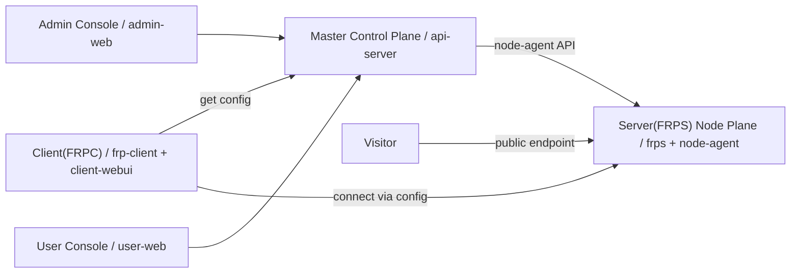

# mefrp 排版动线与 frp-panel 架构重构总计划

> **执行方式：** 按 Task 1 → Task 10 顺序执行，每个 Task 独立构建、测试、提交。
> **计划文件：** `docs/superpowers/plans/2026-07-09-mefrp-layout-architecture-refactor.md`

## 1. 总目标

把当前 FRP 商业平台重构为一套更接近 mefrp 面板信息架构和 frp-panel wiki 角色架构的系统：

1. **排版动线模仿 mefrp**：左侧菜单、顶部工具栏、工作台卡片、资源总览、步骤化创建、表格 + Drawer 编辑。
2. **架构表达对齐 frp-panel**：Master / Server(FRPS) / Client(FRPC) / Visitor 四角色模型。
3. **前端全量工程化**：`user-web`、`admin-web`、`client-webui` 全部升级为 React + Vite + Ant Design。
4. **三端边界清晰**：后台管理端、用户控制台、本地客户端 UI 分离，但共享主题、布局、API client 和通用组件。
5. **真实部署验收**：在飞牛部署，做截图对比和完整功能回归。

---

## 2. 已确认决策

- mefrp 只模仿 **信息架构、排版动线、后台面板组织方式**，不复制品牌、Logo、素材和业务文案。
- frp-panel 架构映射确认：
  - `api-server` = Master Control Plane
  - `node-agent + frps + node-nginx` = Server(FRPS) Node Plane
  - 本地 Win/Linux 客户端 = Client(FRPC)
  - 外部访问者 = Visitor
  - `admin-web` = Admin Console
  - `user-web` = User Console
- 全量引入：React + Vite + Ant Design。
- 视觉方向：蓝白工具面板风。
- 用户入口保持：`http://192.168.110.56:18188`
- 后台入口保持：`http://192.168.110.56:18189`
- 域名/证书保留一级菜单。
- `client-webui` 本次一起改为同风格。
- 旧乱码文档本次修复并改写。
- 验收方式：截图对比 + checklist。
- mefrp 访问秘钥只用于人工/浏览器对比，不写入代码、文档、测试数据。

---

## 3. 参考对象

### 3.1 mefrp 面板

- 地址：`https://www.mefrp.com/dashboard/home`
- 参考重点：
  - 左侧固定菜单
  - 顶部工具栏
  - 工作台首页资源总览
  - 账户、套餐、流量、隧道、节点、公告、快捷入口的排版动线
  - 表格页的筛选 + 表格 + 操作入口
  - 创建流程的任务导向布局

### 3.2 frp-panel wiki

- 地址：`https://vaala.cat/frp-panel/quick-start.html`
- 参考重点：
  - Master
  - Server(FRPS)
  - Client(FRPC)
  - Admin
  - Visitor
  - Client 从 Master 获取配置
  - Client 按配置连接 Server(FRPS)
  - Visitor 访问 Server(FRPS) 暴露的公网入口

---

## 4. 总体架构目标



### 4.1 Master Control Plane

负责：

- 用户
- 套餐
- 订单
- 支付通道
- 兑换码
- 隧道
- 节点
- 证书
- frpc 配置生成
- API 托管测速
- 流量统计

### 4.2 Server(FRPS) Node Plane

负责：

- frps 连接入口
- TCP/UDP 端口池
- HTTP/HTTPS vhost 入口
- node-agent 运维接口
- frps 状态、配置、日志、重启、reload
- node-nginx test/reload

### 4.3 Client(FRPC)

负责：

- 保存 API 地址和 token
- 拉取 Master 生成的配置
- 启动/停止/重启 frpc
- 本地日志
- 本地 benchmark 测速服务

### 4.4 Visitor

负责：

- 访问公网入口
- 通过 Server(FRPS) 转发到用户本地服务

---

## 5. mefrp 排版动线总规范

## 5.1 页面骨架

三端统一使用：

```text
┌──────────────────────────────────────────────────────────────┐
│ 顶部栏：页面标题 / 面包屑 / 刷新 / 用户信息 / 退出        │
├──────────────┬───────────────────────────────────────────────┤
│ 左侧菜单     │ 页面标题区                                    │
│ 分组菜单     │ 指标卡片 / Alert / 快捷入口                  │
│ 可折叠       │ 表格 / 表单 / Steps / Drawer / 日志          │
└──────────────┴───────────────────────────────────────────────┘
```

Ant Design 基础组件：

- `Layout`
- `Sider`
- `Header`
- `Content`
- `Menu`
- `Card`
- `Table`
- `Form`
- `Steps`
- `Drawer`
- `Modal`
- `Alert`
- `Tag`
- `Badge`
- `Statistic`
- `Progress`
- `Typography`

布局参数：

- 左侧栏展开宽度：232px
- 左侧栏收起宽度：72px
- 顶部栏高度：56px
- 内容区 padding：20px
- 卡片间距：16px
- 卡片圆角：10-12px
- 表格密度：`middle` 或 `small`

---

## 5.2 左侧菜单折叠规则

- 两字中文：竖向两字或图标 + tooltip。
- 四字中文：上下两行，每行两个字。
- 英文/混排：图标 + tooltip，不强拆英文。

示例：

```text
套餐管理 -> 套餐
            管理

节点状态 -> 节点
            状态
```

---

## 5.3 用户控制台菜单

```text
概览
- 总览
- 快速开始

隧道
- 隧道列表
- 创建隧道
- 隧道测速

资源
- 节点状态
- 客户端 FRPC
- 域名证书

账户
- 套餐支付
- 兑换码
- 用户中心
- 帮助文档
```

---

## 5.4 后台管理端菜单

```text
Master
- Master 总览
- 系统设置
- 操作日志

业务
- 用户管理
- 套餐管理
- 订单支付
- 兑换码

资源
- 隧道管理
- FRPS 节点
- 域名证书
```

---

## 5.5 本地 client-webui 菜单

```text
本机
- 本机状态
- 配置同步
- frpc 控制

隧道
- 隧道列表
- 测速服务

诊断
- 日志
- 设置
```

---

## 6. 页面级排版规范

## 6.1 总览页

### 用户总览

```text
[账户/套餐状态 Alert]

[套餐状态] [剩余流量] [隧道数量] [在线节点]

[快速开始 Steps]
开通套餐 -> 下载客户端 -> 创建隧道 -> 同步配置 -> 访问入口

左：最近隧道表格
右：公告 / 帮助 / 客户端下载快捷卡片
```

### 后台总览

```text
[Master Control Plane 状态]

[用户数] [有效套餐] [隧道数] [在线 FRPS 节点] [今日订单]

[Admin -> Master -> Server(FRPS) -> Client(FRPC) / Visitor 拓扑]

左：最近订单 / 操作日志
右：节点健康状态 / 支付通道状态
```

### 本地客户端总览

```text
[本地客户端运行状态 Alert]

[API Server] [frpc 状态] [同步隧道数] [测速服务]

[Client(FRPC) 工作流]
填写 API 地址 -> 保存 Token -> 同步配置 -> 启动 frpc -> 查看日志

下方：本地配置摘要 + 日志 tail
```

---

## 6.2 表格页

统一结构：

```text
[页面说明 Alert]
[筛选区 Form inline]
[主操作按钮：新增/生成/刷新]
[Table]
[右侧 Drawer 编辑详情]
```

适用页面：

- 隧道列表
- 用户管理
- 套餐管理
- 订单支付
- 兑换码
- 节点管理
- 操作日志

表格规则：

- ID 用小号灰字。
- 状态统一用 `Tag` / `Badge`。
- URL、Token、配置片段支持复制。
- 行操作统一用 `Dropdown`。
- 新增/编辑统一用 `Drawer`。
- 危险操作统一用 `Modal.confirm`。

---

## 6.3 创建隧道页

改成长表单之外的步骤流：

```text
左侧 Steps：
1 选择协议
2 选择 FRPS 节点
3 填写本地服务
4 配置公网入口
5 确认并创建

右侧：当前步骤表单
下方：配置预览 / 套餐限制 / 注意事项
```

字段：

- 协议：HTTP / HTTPS / TCP / UDP
- 节点：只展示用户安全字段
- 本地服务：host、port
- 公网入口：域名或自动分配端口
- 限速：默认继承套餐；只允许低于套餐限速的覆盖值

创建前展示：

```text
Client(FRPC) 将从 Master 拉取配置，并连接到所选 Server(FRPS)。
Visitor 访问公网入口时，将通过 Server(FRPS) 转发到你的本地服务。
```

---

## 6.4 节点页

### 用户端节点页

```text
[节点说明 Alert]
[节点卡片 Grid]
- 节点名
- 在线状态
- 入口域名
- frps 端口
- TCP/UDP 端口池
- 最后在线
```

### 后台节点页

```text
[节点表格]
行操作：状态 / 配置 / 日志 / 重启 / reload / nginx test / nginx reload

[右侧 NodeOperationPanel]
- 当前节点
- 当前动作
- 返回状态
- 输出内容
- 执行时间
```

---

## 6.5 支付、套餐、兑换码

### 用户端套餐支付

```text
[当前套餐卡片]
[套餐卡片列表]
- 名称
- 价格
- 流量
- 带宽
- 隧道数
- 协议权限
- 购买按钮

[支付方式选择]
- 微信支付
- 支付宝
```

### 用户端兑换码

```text
[说明 Alert：兑换码已绑定套餐]
[输入兑换码 Form]
[兑换结果 Card]
```

### 后台套餐管理

```text
[套餐表格]
[新增/编辑套餐 Drawer]
字段：名称、价格、时长、流量、带宽、隧道数、协议权限、状态
```

### 后台兑换码

```text
[生成兑换码 Card]
- 选择套餐
- 生成数量
- 有效期
- 备注

[兑换码表格]
[兑换日志]
```

### 后台支付方式

```text
[支付方式绑定卡片]
- 支付方式：微信/支付宝
- 支付通道：wxpay_zg 等
- pay_type：wxpay/alipay
- 在线状态
- API 地址

[订单表格]
```

---

## 6.6 隧道测速页

```text
左侧：测速参数 Card
- 本地客户端 API
- 节点
- 协议
- 下载 MB
- 上传 MB
- 套餐限速说明

右侧：实时步骤 Steps
1 本地客户端准备 benchmark
2 Master 创建临时隧道
3 Client 同步临时配置
4 frpc 重启连接 Server(FRPS)
5 API Server 发起测速
6 恢复正式配置
7 清理临时服务

下方：测速结果指标 + 日志
```

结果指标：

- 下载平均速度
- 上传平均速度
- 延迟
- 限速占比
- 瓶颈判断
- 计入流量说明

---

## 7. 前端工程目标结构

## 7.1 共享前端层

```text
apps/shared/frontend/
  api/
    client.js
  theme/
    antdTheme.js
  components/
    AppShell.jsx
    RoleTopology.jsx
    StatusBadge.jsx
    CollapsedMenuLabel.jsx
    MetricCard.jsx
    LogPanel.jsx
    NodeOperationPanel.jsx
    CopyText.jsx
  styles/
    global.css
```

## 7.2 用户控制台

```text
apps/user-web/
  package.json
  vite.config.js
  index.html
  src/
    main.jsx
    App.jsx
    routes.jsx
    pages/
      Overview.jsx
      QuickStart.jsx
      Tunnels.jsx
      CreateTunnel.jsx
      Nodes.jsx
      Client.jsx
      Domains.jsx
      Billing.jsx
      Redeem.jsx
      SpeedTest.jsx
      Help.jsx
      Account.jsx
```

## 7.3 后台管理端

```text
apps/admin-web/
  package.json
  vite.config.js
  index.html
  src/
    main.jsx
    App.jsx
    routes.jsx
    pages/
      Dashboard.jsx
      Users.jsx
      Plans.jsx
      Payments.jsx
      Redeem.jsx
      Tunnels.jsx
      Nodes.jsx
      Certificates.jsx
      Settings.jsx
      Logs.jsx
```

## 7.4 本地客户端 UI

```text
apps/client-webui/
  package.json
  vite.config.js
  index.html
  src/
    main.jsx
    App.jsx
    routes.jsx
    pages/
      Status.jsx
      ConfigSync.jsx
      FrpcControl.jsx
      Tunnels.jsx
      SpeedService.jsx
      Logs.jsx
      Settings.jsx
```

---

## 8. Ant Design 主题计划

```js
export const antdTheme = {
  token: {
    colorPrimary: '#2563eb',
    colorInfo: '#2563eb',
    colorSuccess: '#16a34a',
    colorWarning: '#d97706',
    colorError: '#dc2626',
    colorBgLayout: '#f4f7fb',
    colorBgContainer: '#ffffff',
    colorBorder: '#dbe4f0',
    borderRadius: 10,
    fontSize: 14,
    controlHeight: 36,
  },
  components: {
    Layout: {
      headerBg: '#ffffff',
      siderBg: '#ffffff',
    },
    Menu: {
      itemBorderRadius: 8,
      itemSelectedBg: '#e8f1ff',
      itemSelectedColor: '#1d4ed8',
    },
    Card: {
      borderRadiusLG: 12,
    },
    Table: {
      headerBg: '#f8fafc',
      rowHoverBg: '#f8fbff',
    },
  },
};
```

---

## 9. 后端 API 调整计划

新增或整理：

- `GET /api/user/topology`
- `GET /api/admin/topology`

用户端 topology 只返回：

- subscription
- traffic
- tunnel counts
- safe nodes
- client downloads
- current user summary

后台 topology 返回：

- user count
- active subscription count
- tunnel count
- online node count
- payment provider status
- recent orders
- recent operations

安全要求：

- 普通用户不能拿到 agent token。
- 普通用户不能拿到支付密钥。
- 普通用户不能拿到 admin-only 字段。

---

## 10. 任务拆分

## Task 1：领域模型和架构文档

文件：

- `CONTEXT.md`
- `docs/adr/0002-frp-panel-role-architecture.md`
- `docs/architecture/frp-panel-role-map.md`

工作：

- [ ] 补充 Master / Server(FRPS) / Client(FRPC) / Visitor 术语。
- [ ] 新增 ADR。
- [ ] 新增架构映射文档。
- [ ] 提交：`docs: align architecture vocabulary with frp-panel roles`

---

## Task 2：共享 React 前端基础层

文件：

- `apps/shared/frontend/api/client.js`
- `apps/shared/frontend/theme/antdTheme.js`
- `apps/shared/frontend/components/*.jsx`
- `apps/shared/frontend/styles/global.css`

工作：

- [ ] API client。
- [ ] Ant Design 主题。
- [ ] AppShell。
- [ ] RoleTopology。
- [ ] CollapsedMenuLabel。
- [ ] StatusBadge。
- [ ] MetricCard。
- [ ] LogPanel。
- [ ] NodeOperationPanel。
- [ ] 提交：`feat: add shared react frontend foundation`

---

## Task 3：用户控制台 React 重构 + mefrp 排版

文件：

- `apps/user-web/package.json`
- `apps/user-web/vite.config.js`
- `apps/user-web/index.html`
- `apps/user-web/src/**/*.jsx`
- `apps/user-web/Dockerfile`
- `apps/user-web/nginx.conf`

工作：

- [ ] 用户端菜单按本计划分组。
- [ ] 总览页按 mefrp 工作台排版。
- [ ] 快速开始 Steps。
- [ ] 创建隧道 Steps + Form。
- [ ] 隧道列表 Table。
- [ ] 节点状态卡片。
- [ ] 客户端 FRPC 页面。
- [ ] 域名证书页面。
- [ ] 套餐支付页面。
- [ ] 兑换码页面。
- [ ] 隧道测速 7 步流程。
- [ ] `npm run build` 通过。
- [ ] 提交：`feat: rebuild user console with mefrp layout`

---

## Task 4：后台管理端 React 重构 + mefrp 排版

文件：

- `apps/admin-web/package.json`
- `apps/admin-web/vite.config.js`
- `apps/admin-web/index.html`
- `apps/admin-web/src/**/*.jsx`
- `apps/admin-web/Dockerfile`

工作：

- [ ] 后台菜单按本计划分组。
- [ ] Master 总览。
- [ ] 用户管理支持修改套餐。
- [ ] 套餐管理支持新增/编辑。
- [ ] 订单支付展示支付方式绑定。
- [ ] 兑换码生成可选择套餐。
- [ ] FRPS 节点操作完整可用。
- [ ] 节点操作结果进入 NodeOperationPanel。
- [ ] `npm run build` 通过。
- [ ] 提交：`feat: rebuild admin console with mefrp layout`

---

## Task 5：client-webui React 重构 + 同风格排版

文件：

- `apps/client-webui/package.json`
- `apps/client-webui/vite.config.js`
- `apps/client-webui/index.html`
- `apps/client-webui/src/**/*.jsx`
- `apps/client-webui/Dockerfile`

工作：

- [ ] 本机状态。
- [ ] 配置同步。
- [ ] frpc 控制。
- [ ] 隧道列表。
- [ ] 测速服务。
- [ ] 日志。
- [ ] 设置。
- [ ] `npm run build` 通过。
- [ ] 提交：`feat: rebuild client webui with mefrp layout`

---

## Task 6：后端 topology 和安全字段

文件：

- `apps/api-server/internal/platform/server.go`
- `apps/api-server/internal/platform/models.go`
- `apps/api-server/internal/platform/server_test.go`

工作：

- [ ] `GET /api/user/topology`。
- [ ] `GET /api/admin/topology`。
- [ ] 测试用户端不暴露敏感字段。
- [ ] 飞牛执行 Go 测试。
- [ ] 提交：`feat: add role topology summaries`

---

## Task 7：Docker 和 compose 调整

文件：

- `apps/user-web/Dockerfile`
- `apps/admin-web/Dockerfile`
- `apps/client-webui/Dockerfile`
- `deploy/docker-compose.fnos.yml`
- `deploy/docker-compose.control.yml`
- `deploy/docker-compose.node.yml`

工作：

- [ ] 三个前端 Dockerfile 改为 Node build + Nginx serve。
- [ ] 确认用户端 downloads 仍可用。
- [ ] compose 注释对齐 Master / Admin Console / User Console / Server(FRPS)。
- [ ] 提交：`build: add vite react frontend builds`

---

## Task 8：旧文档修复和架构改写

文件：

- `docs/plans/02-ARCHITECTURE.md`
- `deploy/SPLIT_DEPLOYMENT.md`
- `README.md`

工作：

- [ ] 修复乱码。
- [ ] 用四角色模型重写架构。
- [ ] 补充后台、用户端、本地客户端入口。
- [ ] 提交：`docs: rewrite architecture docs with frp-panel roles`

---

## Task 9：部署前构建测试

工作：

- [ ] `npm install && npm run build` for `apps/user-web`
- [ ] `npm install && npm run build` for `apps/admin-web`
- [ ] `npm install && npm run build` for `apps/client-webui`
- [ ] 飞牛执行：`go test ./apps/api-server/... ./client/frp-client/...`

---

## Task 10：飞牛部署、截图对比和真实验收

部署：

```bash
docker compose -f deploy/docker-compose.fnos.yml --env-file deploy/.env.fnos up -d --build api-server user-portal admin-portal
```

截图对比：

- `https://www.mefrp.com/dashboard/home`
- `https://vaala.cat/frp-panel/quick-start.html`
- `http://192.168.110.56:18188`
- `http://192.168.110.56:18189`
- client-webui 本地或容器入口

验收 checklist：

- [ ] 左侧菜单 + 顶部栏 + 内容卡片是否接近 mefrp。
- [ ] 用户总览是否先展示账户/套餐/资源/快捷入口。
- [ ] 后台总览是否能看出 Master / Server(FRPS) / Client(FRPC) / Visitor。
- [ ] 创建隧道是否步骤化。
- [ ] 表格页是否统一为筛选 + 表格 + Drawer。
- [ ] 节点状态/配置/日志/重启是否可用。
- [ ] 套餐新增/修改是否可用。
- [ ] 后台用户管理是否能修改用户套餐。
- [ ] 兑换码生成是否能选择套餐。
- [ ] 支付方式绑定入口是否清楚。
- [ ] 支付下单是否不再提示未配置通道。
- [ ] 折叠菜单四字是否上下各两个字。
- [ ] 用户端是否不暴露敏感字段。
- [ ] API Server 托管测速是否完成真实流程。
- [ ] client-webui 是否同风格且基本功能可用。

验收文档：

- [ ] 新增 `docs/FINAL_MEFRP_REDESIGN_ACCEPTANCE.md`
- [ ] 提交：`docs: add mefrp redesign acceptance report`
